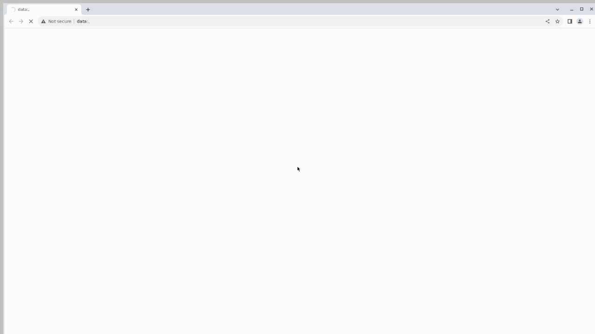

# Проект по тестированию сайта Научно-Технического Центра ПРОТЕЙ
> <a target="_blank" href="https://protei.ru/">Ссылка на портал</a>

> 
____
## **Содержание:**

* <a href="#tools">Технологии и инструменты</a>

* <a href="#cases">Список реализованных проверок</a>

* <a href="#jenkins">Сборка в Jenkins</a>

* <a href="#console">Запуск из терминала</a>

* <a href="#allure">Allure отчет</a>

* <a href="#allure-testops">Интеграция с Allure TestOps</a>

* <a href="#jira">Интеграция с Jira</a>

* <a href="#telegram">Уведомление в Telegram при помощи бота</a>

* <a href="#video">Примеры видео выполнения тестов на Selenoid</a>
____
<a id="tools"></a>
## <a name="Технологии и инструменты">**Технологии и инструменты:**</a>

<p align="center">


</p>

____
<a id="cases"></a>
## <a name="Список реализованных проверок">**Список реализованных проверок:**</a>
#### Список проверок, реализованных в автотестах
- [x] Проверка перехода на страницу информации о компании с главной страницы сайта
- [x] Проверка перехода на страницу продуктов компании с главной страницы сайта
- [x] Проверка соответствия контактов компании на странице "Контакты"
- [x] Проверка того, что все поля формы обратной связи являются обязательными для заполнения
- [x] Проверка работы поиска по сайту после ввода запроса на главной странице
- [x] Проверка закрытия строки поиска при нажатии на любое место на странице
- [x] Проверка закрытия строки поиска при нажатии на соответствующую кнопку
#### Список проверок ручного тестирования
- [x] Проверка смены карты при переключении типов внедрений на главной странице
- [x] Проверка отправки заполненной формы обратной связи

____
<a id="jenkins"></a>
## </a><a name="Сборка"></a>Сборка в [Jenkins](https://jenkins.autotests.cloud/job/26-Lorminel-protei/)</a>

 

### **Параметры сборки в Jenkins:**

- *TASK* - запуск задачи, по умолчанию запускаются все тесты protei_tests
- *BROWSER* - браузер, по умолчанию chrome
- *BROWSER_SIZE* - размер окна браузера, по умолчанию 1920x1080
- *BROWSER_VERSION* - версия браузера, по умолчанию 120.0
- *REMOTE_URL* - логин, пароль и адрес удаленного сервера Selenoid
____
<a id="console"></a>
## Команды для запуска из терминала


#### Локальный запуск:
```bash  
gradle clean protei_tests
```

#### Удалённый запуск через Jenkins:
```bash  
clean ${TASK} 
"-Dbrowser=${BROWSER}" 
"-Dbrowser_size=${BROWSER_SIZE}" 
"-Dbrowser_version=${BROWSER_VERSION}" 
"-Dremote_url=${REMOTE_URL}"
```
____
<a id="allure"></a>
## </a> <a name="Allure"></a>Allure [отчет](https://jenkins.autotests.cloud/job/26-Lorminel-protei/allure/)</a>
### По результатам каждого запуска тестов в Jenkins создается Allure отчет с подробной информацией по каждому пройденному тесту.

### Основная страница отчета


### Тест-кейсы


____
<a id="allure-testops"></a>
## </a>Интеграция с <a target="_blank" href="https://allure.autotests.cloud/project/4202/dashboards">Allure TestOps</a>
### Полная статистика по прохождению тест-кейсов, отчёты и приложения к ним хранятся в Allure TestOps(запрос доступа admin@qa.guru).

### *Allure TestOps Dashboard*


### *Автоматизированные тест-кейсы*


### *Ручные тест-кейсы*


____
<a id="jira"></a>
## </a> Интеграция с <a target="_blank" href="https://jira.autotests.cloud/browse/HOMEWORK-1201">Jira</a>
### Результаты выполнения тестов и информация о выявленных дефектах интегрированы с Atlassian Jira.


____
<a id="telegram"></a>
## </a> Уведомление в Telegram при помощи бота
### Настроено автоматическое оповещение о результатах сборки Jenkins в Telegram-бот.


____
<a id="video"></a>
## </a> Пример видеозаписи прохождения теста

   
